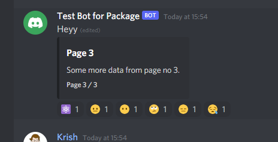

# A library to make your discord bot easily.

`djs-utility` is for helping you out to write less code and do your stuff. It provides you with some pre-written code which you can to do compicated in just cuople of lines.

# Documentation

Install the package

```bash
npm install djs-utility
```

Importing the package

```js
const utility = require("djs-utility");
```

or via import

```js
import * as utility from ("djs-utility");
```

## Using the features

### `pagination`

```js
const { pagination } = require("djs-utility");

pagination({
  message: message,
  pages: [embedOne, embedTwo, ..., lastEmbed],
  initialText: "`!help command` will show an extra help"
});

```

**Parameters:**

- **message** - The message object (required)
- **pages** - An array of `MessageEmbed`s as individual pages (required)
- **initialPage** - The starting page number if you don't want it to be 0. _Default is 0_ (optional)
- **initialText** - If you want any extra text on top of every pages. _Default is ""_ (optional)
- **timeout** - The maximun amount of time the reaction collector will listen for reactions. _Default is `12000`_. (optional)
- **emojis** - If you don't want the default emojis. Pass an object. (optional)

```js
emojis: {
  pageNumber: EmojiResolvable,
  home: EmojiResolvable,
  left: EmojiResolvable,
  right: EmojiResolvable,
  end: EmojiResolvable,
  stop: EmojiResolvable,
}
```

> You can also import `paginationEmbedOptions` and `emojiOptions` for defining optional variables.
> For example:

```ts
import { paginationEmbedOptions, emojiOptions, pagination } from "djs-utility";
const emojis: emojiOptions = {
  ...
}

const options: paginationEmbedOptions = {
  ...,
  emojis
}

pagination(options);
```

> Output:
>
> 

> _Note: You need some intents to enable these features as per discord.js@v13. For reference see [index.ts](./src/test-bot/index.ts)_

---
### `string pagination`

```js
const { stringPagination } = require("djs-utility");

stringPagination({
  message: message,
  pages: [embedOne, embedTwo, ..., lastEmbed]
});
```

**Parameters:**

- **message** - The message object (required)
- **pages** - An array of `String` as individual pages (required)
- **initialPage** - The starting page number if you don't want it to be 0. _Default is 0_ (optional)
- **timeout** - The maximun amount of time the reaction collector will listen for reactions. _Default is `12000`_. (optional)
- **emojis** - If you don't want the default emojis. Pass an object. (optional)

> Emojis are same for this too (`emojiOptions`)
>
> Similarly you can also import `stringPaginationEmbedOptions`.

> For example:

```ts
import { stringPaginationEmbedOptions as pgOptions, stringPagination } from "djs-utility";
const options: pgOptions = {
  ...
}

stringPagination(options);
```

> For NodeJS you can also set alias. For example:

```js
const { stringPagination: pagination } = require("djs-utility");

pagination(...);
```

> _Note: You need some intents to enable these features as per discord.js@v13. For reference see [index.ts](./src/test-bot/index.ts)_

---
### `confirm`

```js
const { confirm } = require("djs-utility");

confirm({
  message,
  content: "Are you sure?",
})
  .then((result) => {
    // result is true if user reacts with the check
    // or else it's false if user reacts with cross emoji
  })
  .catch((err) => {
    // err.error = true
    // in the most cases err.errorType will be timeout error
  });
```

**Parameters:**

- **message** - The message object (required)
- **content** - Either it must be a `string` or `MessageEmbed` (required)
- **timeout** - The maximun amount of time the reaction collector will listen for reactions. _Default is `60000`_. (optional)
- **emojis** - If you don't want the default emojis. Pass an object. (optional)
  - check - The check emoji which results to true
  - cross - The cross emoji which results to false

> You can import `confirmOptions` for typescript intellisense
>
> For example:

```ts
import { confirm, confirmOptions } from "djs-utility";
const options: confirmOptions = {
  ...
}

confirm(options);
```

> _Note: You need some intents to enable these features as per discord.js@v13. For reference see [index.ts](./src/test-bot/index.ts)_

---
### `codeBlockParser`
A code Block Parser to extract language and code out of code blocks.

**Parameters:**
- **string** - string containing codeBlock

**return:**
- `Array<[Object]>`
  - `lang ?: string`
  - `code ?: string`
> Example :

```ts
import {codeBlockParser} from "djs-utility";
console.log(
  codeBlockParser("```js\n🥳🥳🥳🥳🥳🥳🥳🥳🥳🥳 working```"));
```
> Output :

```js
[{ lang: 'js', code: '🥳🥳🥳🥳🥳🥳🥳🥳🥳🥳 working' }]
```

---
# Contributing
Contributions are always welcome!

### Steps to contribute:

1. Fork the repo
1. Clone the repo `git clone <your forked repo>`
1. Make a new branch for your feature
1. Write the code
1. Make a new file called `config.js` in `test` folder and copy the contents of `test/sample.config.js` and update the token.
1. Run `npm run test:all` _(See more scripts in `package.json`)_
1. Push you code and make a pull request
1. That's it!

> Then you code will be reviewed by the authors.
